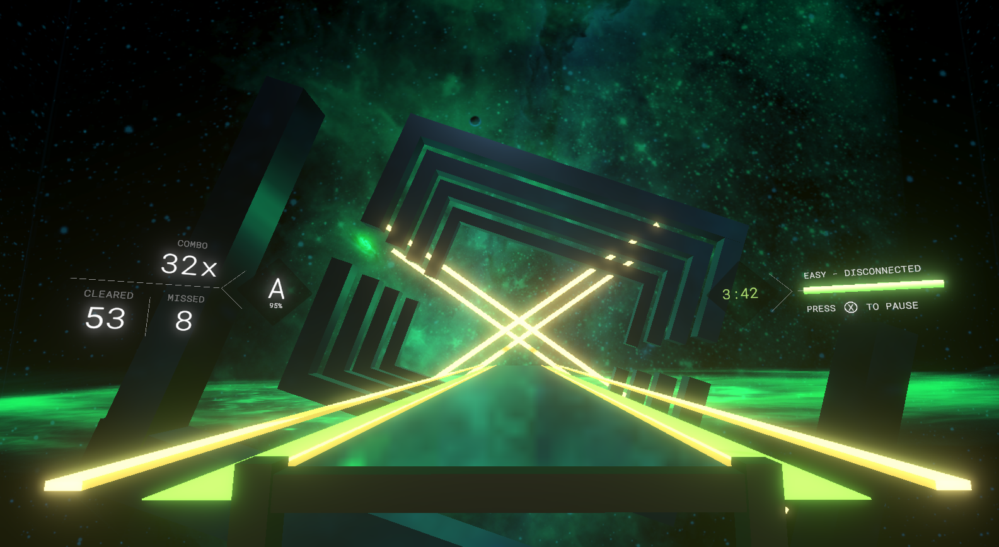
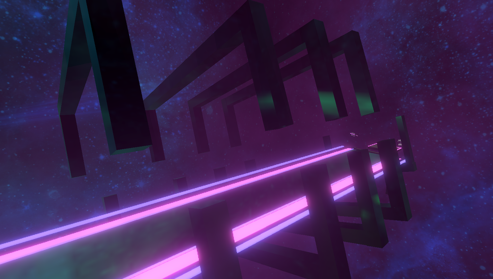
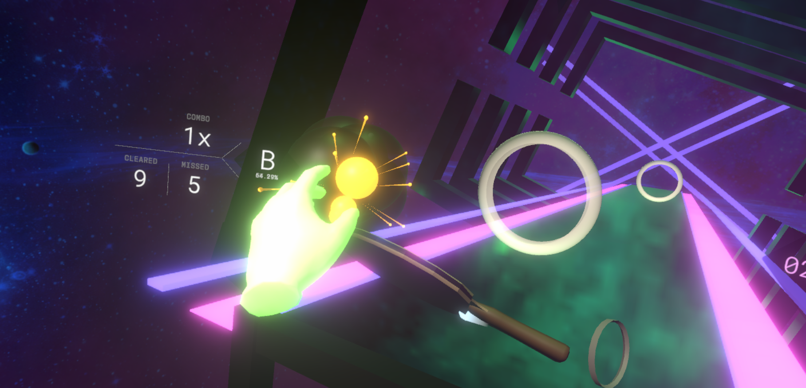
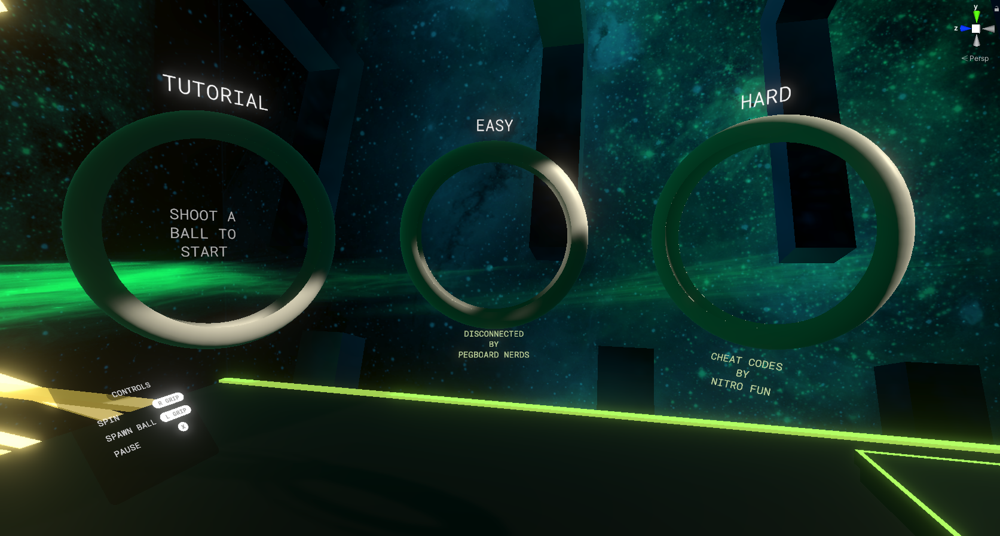
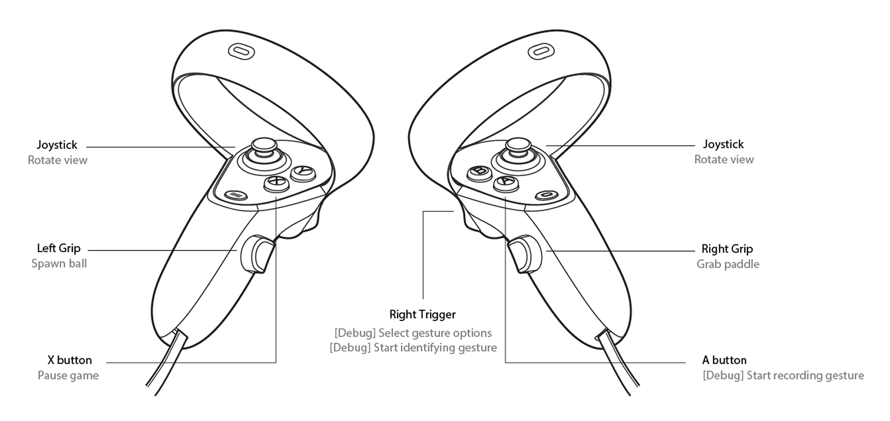
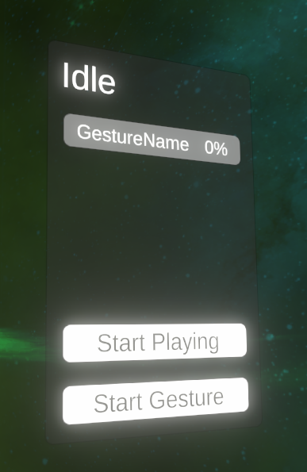

# HyperPong
VR Beat Saber for Table Tennis  
Final Project for CS4240 - Interaction Design for VR and AR  
 

 

 
**Authors:**  
Bu Wen Jin  
Koh Zheng Qiang Shawn  
Hong Yi En, Ian  
Siti Nurul Syasya Bte Azman  
Wei Chen Kun  
Concept by [STUCK Design](https://www.stuck.sg)

## Installation Instructions
**Unity Version:** 2020.3.31f1  
**Build target:** Any headset that supports OpenXR, Tested on Oculus Quest and Meta Quest 2

### Packages
- 2D Sprite 1.0.0
- Inpus System 1.3.0
- JetBrains Rider Editor 3.0.13
- Oculus XR Plugin 1.11.2
- OpenXR Plugin 1.3.1
- Post Processing 3.2.1
- ProBuilder 5.0.4
- ProGrids 3.0.3-preview.6 (Enable preview packages. [Tutorial on how to do that](Met://medium.com/@jeffreymlynch/where-are-the-missing-preview-packages-in-unity-2020-3ad0935e4193))
- Test Framework 1.1.31
- TextMeshPro 3.0.6
- Timeline 1.4.8
- Unity UI 1.0.0
- Universal RP 10.8.1
- Visual Effect Graph 10.8.1
- Visual Studio Code Editor 1.2.5
- Visual Studio Editor 2.0.14
- XR Interaction Toolkit 2.0.1
- XR Plugin Management 4.2.1

#### Already installed in the project
- https://github.com/neuecc/UniRx
- https://github.com/mcintyre321/OneOf

## How to Play
### Safety
- Stand in an open space where you can fully stretch your arms out around you in every direction.  
- Always be wary of any wires connected to the headset.

### Gameplay

 
HyperPong immerses you in a world where only two things matter: spinning balls and feeling the beat. 
Spawn balls using the left grip button and grab that table tennis paddle on the floor using the right grip button and start playing! 
 

 
All our interactive menus are triggered by hitting the ball into the selection hoops so you're sure to get that practice time in! 
If you are new, there is always the tutorial to guide you through. But fret not, it is as easy as 1 2 3, bound to get you to start playing in under a minute! Now what are you waiting for? Get in there, groove to fantastic music and play some HyperPong!

### Controls
#### Oculus Quest / Quest 2

**LH** 
- Joystick: snap rotate field of view
- Left Grip: Spawn and hold on to ping pong ball
- X: Pause game (in game scene)

**RH** 
- Joystick: snap rotate field of view
- Trigger: [Debug] select options on Gesture Panel, [Debug] start gesture recognition
- Right Grip: Grab paddle
- A: [Debug] Start recording gesture for training (held ball turns blue)

#### How to create a new spinning gesture and train the ML model to recognise it

 
- S is the number of saved samples
- T is the number of trained samples that have not been saved
- U is the number of untrained samples that have not been saved
 

1. Once you reach the song scene, pause the music with X (the alternative button on the Left controller). Notice the gesture menu on your right.
2. Use the right trigger to select `Start Gesture`
3. `Create Gesture`
4. After that, point at your new gesture and use the right trigger to select it
5. Grab the paddle and hold a ball.
6. Press A, the **primary button on your right controller** to start recording a gesture sample. The ball will turn blue. The sample ends when the ball contacts the paddle, and the ball returns to white. You can cancel the recording by pressing A again.
7. Record at least 30 samples for the training to be accurate. the U should increase each time you record a new gesture.
8. After that, point at your new gesture and use the right trigger to select it
9. Select `Train Gesture`. The U will become 0 and the T will become 30.
10. After that, `Save Gesture` and go back. HyperPong will now be able to recognise the trained gesture.

#### How to enable the model to identify spinning gestures
1. Once you reach the song scene, pause the music with X (the alternative button on the Left controller). Notice the gesture menu on your right.
2. Choose `Start Playing`
3. Select the gesture that you wish to be detected
4. While holding the ball and the racket, hold the **right trigger** and perform the gesture while hitting the ball with your paddle.
5. If the gesture you performed was similar enough (40%), the ball will turn blue and its flight trajectory will curve.
 
Note: If you let go of the trigger button before the racket hits the ball, the gesture stops getting identified and is discarded.

## Assets Used
- XR Interaction Toolkit by Unity
- sFuture Targeting by Sami Lehtonen
- MiVRy - 3D Gesture Recognition by MARUI-Plugin

## Sounds Used
_The following sounds belong to their respective owners:_
### Songs
- [Disconnected by Pegboard Nerds](https://www.youtube.com/watch?v=MwSkC85TDgY)
- [Cheat Codes by Hyper Potions](https://www.youtube.com/watch?v=mdaCDsN1FJ0)

### Freesound
- Ding Effect by JulesV4
- Ping pong hit by 14FPanskaBubikLukas
- bang-04-clean by Eelke

